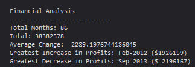

# Module 4 Challenge - Logging Financial Details to the Console

## Table of Contents
1. [URL](#url)
2. [Description](#description)
3. [Installation](#installation)
4. [Usage](#usage)
5. [Credits](#credits)

## URL 

A live version of this page has been deployed at https://spacepineapple.github.io/console-finances/

## Description 

This page was created as my solution to the fourth challenge task of a web
development bootcamp. For this task, I was provided with some starter code
consisting of an index.html file containing all of the basic HTML boilerplate
and a JavaScript file containing a single variable -- an array called finances.
This array contained a number of smaller arrays, each consisting of a single
month and a single numerical value.

My task for this activity was to calculate:
1. The total number of months in the array
2. The net total of the values in the array
3. The average monthly change of the numerical values in the array
4. The period with the greatest monthly increase
5. The value of this greatest monthly increase
6. The period with the greatest monthly decrease
7. The value of this greatest monthly decrease.

Finally, I was asked to log each of these values to the console in a specific
format which matches the format that can be seen in the screenshot of the
console below.

Due to the nature of this task, the page itself should appear as a blank white
page. However, opening the console will display the following message: 

## Installation 

All of the required files are included in this repository and no installation
should be required. The index.html file should render in any modern browser on
both a desktop or mobile device. However, please note that due to the nature of
this task, the page itself is blank and a user will need to open the console to
see the output. 

## Usage 

## Credits 

